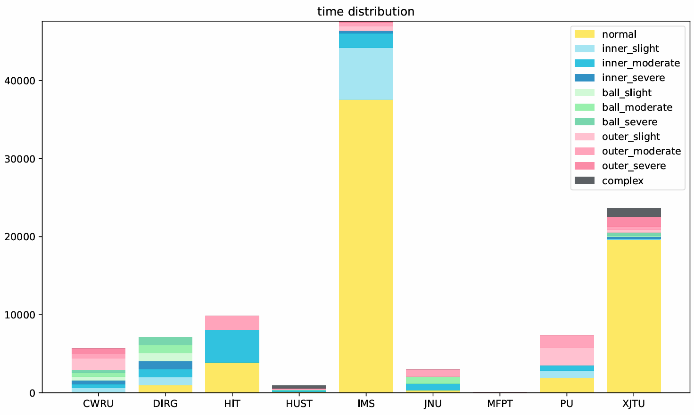
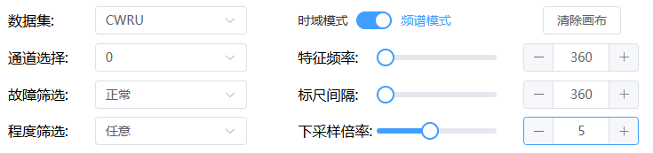
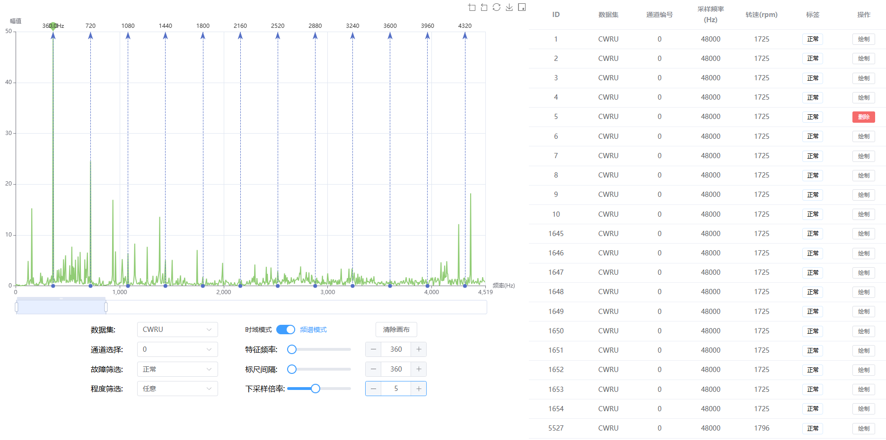
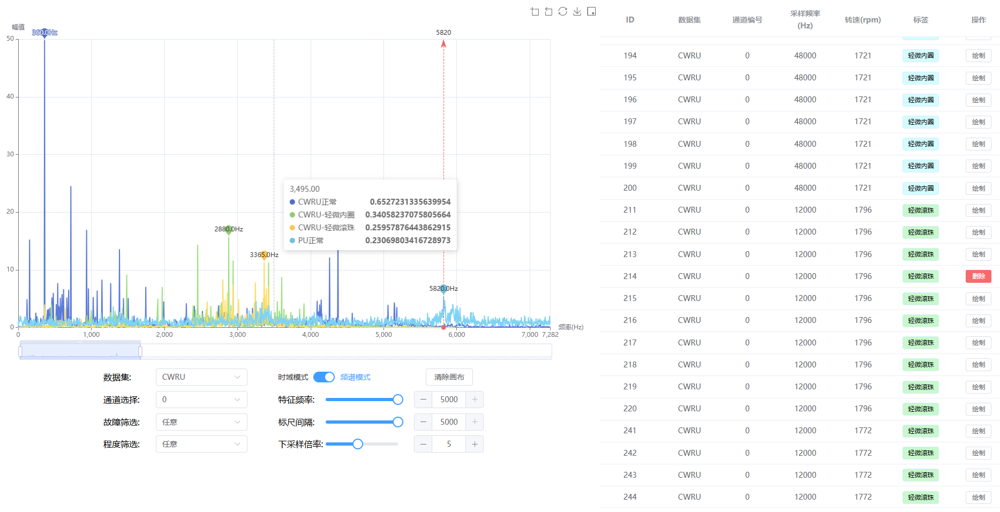

# bearing-dataset-collection

轴承振动公开数据集集合

# 项目功能

## 数据集集成

本项目集成了多个公开数据集的数据内容，并处理为相同的数据格式（所有数据均被处理为1秒/个的数据样本，并使用fft得到其频域特征）。

本项目目前已包含的公开数据集如下：

## 样本筛选

可以通过数据集、通道、故障、严重程度对所有样本进行筛选，并选择时域或频域显示。为了显示的流畅性，绘图默认使用下采样方式进行显示（如下采样倍率设为5，则每5个采样点显示1个）。

## 时域/频谱分析

点击样本右侧的绘制按钮，可以可视化显示样本频谱。前端自动将幅值最大的频率点作为特征频率，并默认使用标尺显示各倍频。特征频率和标尺间隔可通过拖动滑块快速调节，也可通过按钮与输入框精确调节。

## 跨数据集、故障类型对比

支持同时显示多个数据集、多种不同故障类型的频域/时域信号进行对比，挖掘故障特征。

# 项目实现

## 前端

使用Vue.js实现动态响应，控件使用了Element-Plus，使用echarts进行图像绘制，使用axios与后端进行通信。

## 后端

使用Python编写，使用FastAPI与前端通信，numpy进行数据处理，sqlite3进行数据读写。

# 部署教程

## 前端部署

1. 配置node.js
   前往[官网](https://nodejs.org/en/download/package-manager)下载自己操作系统的nodejs。windows下可以下载安装包安装，也可以下载二进制文件，解压后配置环境变量。

2. 安装依赖
   在命令行/Powershell下进入项目根目录，运行命令`npm install`。稍等一段时间会自动完成依赖安装。

3. 运行前端
   
   如果修改了后端地址/端口，请同步修改`./src/utils.ts`内的`backUrl`变量。

   1. 简易方法
      可在`package.json`中修改前端监听的host和端口。
      在命令行/Powershell下进入项目根目录，运行命令`npm run dev`。
   
   2. 生产环境
      在命令行/Powershell下进入项目根目录，运行命令`npm run build`， 得到dist静态文件，使用Apache等工具进行生产环境部署。

## 后端部署

1. 安装python  
   前往[官网](https://www.python.org/downloads/)下载python安装程序，或者使用[miniconda](https://docs.anaconda.com/free/miniconda/miniconda-other-installer-links/)或者Anaconda。如果你使用venv或者conda，请确保进行以下步骤前进入虚拟环境。

2. 安装依赖  
   在命令行/Powershell下进入项目内的`backend`目录，运行`pip3 install -r requirements.txt`。

3. 下载数据库文件  
   还没找到合适的网盘，等填坑。

4. 运行后端  
   可修改`./backend/config.yaml`文件，修改数据库文件存放位置，后端监听端口和host。注意，如果你需要修个CORS规则，只允许特定域名或IP访问后端，可以去掉origins下的'*'，并修改问你允许的域名或IP列表。   
   修改完配置文件后运行`main.py`即可启动后端。

# 二次开发

本项目仅供学习交流使用，所有数据集也都是由网上公开内容收集汇总行程，请勿用于商业用途，否则可能面临复杂的版权纠纷。

如果你需要增加新的数据集可以查看`dev`文件夹下的相关代码。

如果有问题可以提交issue或联系pht0613@163.com。
